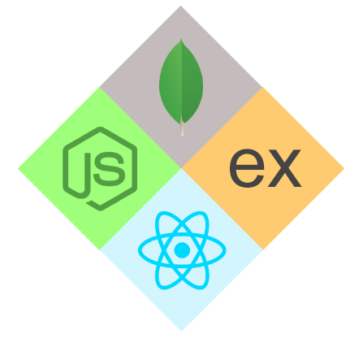

# 👋 Hi, I'm Christian Possidonio

Tech Lead & Senior Software Engineer specialized in building scalable, high-performance digital products for web and mobile platforms.

For over 10 years, I’ve been architecting and developing modern applications with strong focus on scalability, performance, SEO, accessibility, and engineering excellence.

My expertise combines technical leadership, software architecture, frontend performance, backend engineering, and product scalability — helping teams deliver reliable and high-quality digital experiences.

---

🌐 Website: https://possidonio.com

---

## 🚀 Expertise

- Tech Leadership
- Software Architecture
- Scalable Web & Mobile Applications
- Performance Engineering
- Core Web Vitals Optimization
- SEO & Technical SEO
- WCAG Accessibility
- Frontend & Backend Engineering
- Developer Experience (DX)
- Product Scalability & Engineering Quality

---

## 💻 Main Technologies

### Frontend
- React.js
- Next.js
- React Native
- TypeScript
- Tailwind CSS
- Shadcn UI

### Backend
- Node.js
- NestJS
- Express.js
- Fastify

### Databases
- MongoDB
- Cassandra
- PostgreSQL
- MySQL
- MariaDB

---

## 🧠 Engineering Mindset

I believe software engineering goes beyond writing code.

Great digital products are built through:
- scalable architecture
- performance-first mindset
- accessibility
- maintainable systems
- engineering quality
- user-centric experiences

My mission is to create products that scale technically and generate real business impact.

---

## 🔗 Connect With Me

---

## ⚙️ Technologies & Tools

---

> “Engineering is not just about writing code — it's about building scalable, reliable, and meaningful digital products.”
